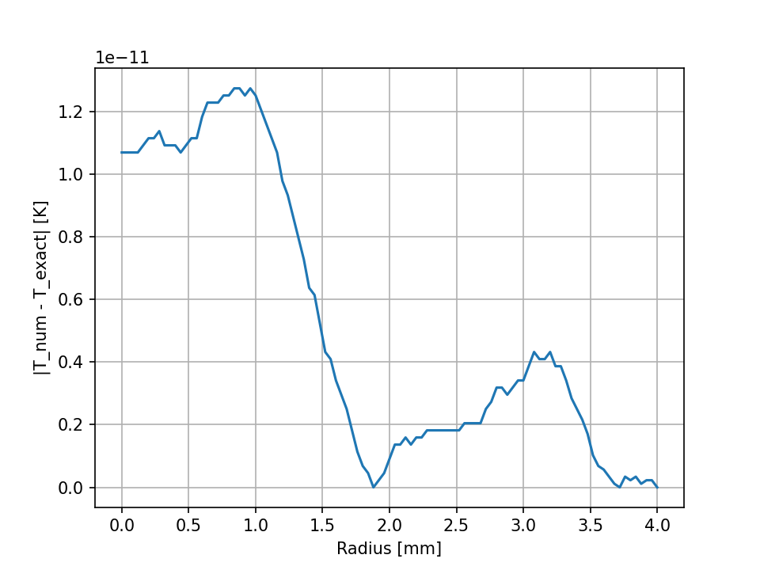
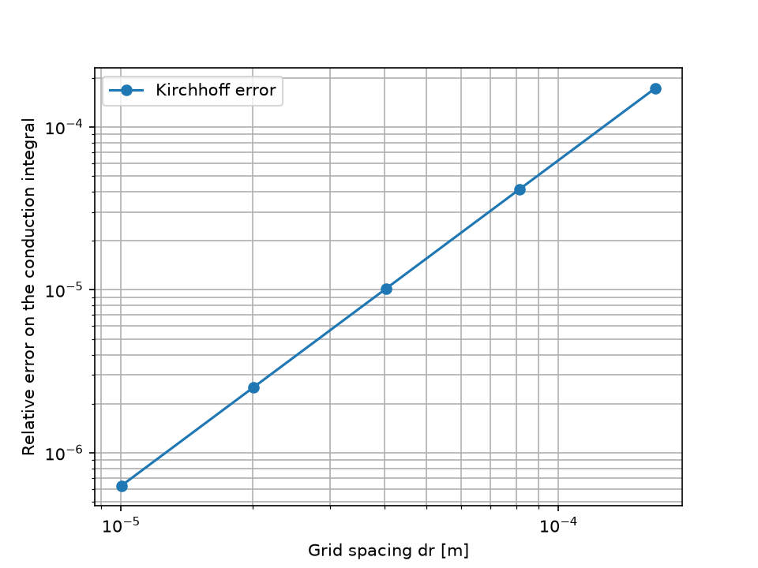
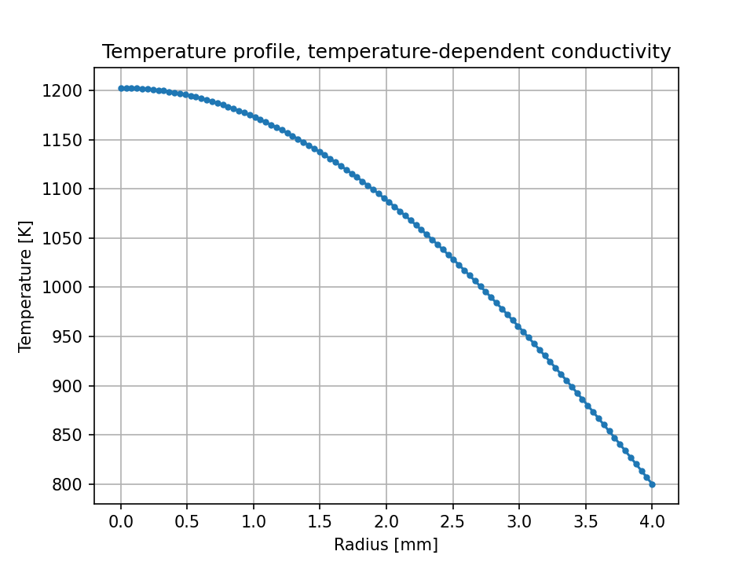

# nuclear-fuel-thermal-solver

This is a small solver for the temperature inside a nuclear fuel pellet. It's 1D (only the radius matters), steady state, and uses finite differences.

I built it between the end of August and mid-September 2026, in about three weeks. I'd just passed Analisi e Calcolo Numerico, the numerical methods course at Sapienza, and I found the subject a lot more interesting than I expected, so I wanted to try those methods on an actual physical problem instead of exam exercises. I also want to go into nuclear engineering, and I wanted to push myself with Python, which I knew much less than MATLAB.

The problem itself comes from a Fisica Tecnica (heat transfer) exercise: a fuel rod with the pellet, the cladding and the coolant around it. I kept only the pellet, since that's where the interesting part is: heat generated inside, and a conductivity that changes with temperature. I haven't taken the nuclear plants course yet (it's next semester), so everything here is built from heat transfer and numerical methods.

I worked out all the maths on paper first. Then I wrote the solver in MATLAB, because that's what I'd used for the exam, and once it worked I ported it to Python. Before porting I spent some time reading up on NumPy and the other libraries, which I'd never used, and that made the port go smoothly. The Python code is the one I test and keep updated. The MATLAB files in `matlab_prototype/` are my original version, left as they were.

## The problem

The pellet generates heat everywhere inside it (q''', in W/m^3), and that heat has to leave through the outer surface. At steady state the temperature T(r) satisfies

```
(1/r) d/dr ( r k(T) dT/dr ) + q''' = 0
```

The centre is a symmetry point, so dT/dr = 0 there. The surface at r = R is held at a fixed T_wall.

I solved it twice.

**Constant conductivity.** If k is just a number, the equation is linear and the exact answer is a parabola:

```
T(r) = T_wall + q''' (R^2 - r^2) / (4k)
```

**Conductivity that depends on temperature.** In real UO2, k drops as the fuel gets hotter. I used

```
k(T) = 1 / (0.0375 + 2.165e-4 T)      [W/m/K, T in K]
```

which is the phonon term of the correlation recommended by Harding and Martin (J. Nucl. Mater. 166 (1989) 223-226). Their full formula has a second term that matters at high temperature, but in this pellet it's below 1e-6 W/m/K against a k of about 5, so I left it out.

With k(T) the equation is nonlinear, but it still has an exact solution. Using the Kirchhoff transform K(T) = integral of k dT, it becomes the linear one again, K(T) - K(T_wall) = q''' (R^2 - r^2)/4, and for this k(T) you can invert it by hand:

```
T(r) = [ (A + B T_wall) exp( B q''' (R^2 - r^2) / 4 ) - A ] / B      A = 0.0375, B = 2.165e-4
```

So in both cases I can compare the numerical solution with an exact one.

The default values are R = 4 mm, q''' = 150 MW/m^3 and T_wall = 600 K.

## How the code works

The equation is discretised with second-order central differences on a uniform grid.

The centre node was the part that took me longest. We never did anything like it in the course: the condition there is a zero flux, not a temperature, and on top of that the 1/r term blows up at r = 0. What I ended up doing is taking the limit of the operator as r goes to 0 and using the symmetry T(-dr) = T(dr), which turns the zero-flux condition into an ordinary row of the system:

```
4 k (T1 - T0) / dr^2 + q''' = 0
```

With constant k the result is a tridiagonal linear system, which I solve with my own Thomas algorithm (`linear_solvers.py`).

With variable k I use Newton's method. The residual and the Jacobian are written by hand, from the derivation on paper. The derivatives of k(T) come from SymPy, so a different conductivity law only means changing one expression. Newton stops when the temperature change between two iterations is below the tolerance, and if it runs out of iterations it raises an error instead of quietly returning a wrong answer.

```
python/
  linear_solvers.py            Thomas algorithm
  constant_conductivity.py     constant k, compared with the parabola
  variable_conductivity.py     variable k, Newton, convergence study
tests/                         12 pytest tests
figures/                       plots, created by the scripts
matlab_prototype/              my first MATLAB version
```

## Running it

I've only tried this on Windows with Python 3.12.

```
python -m venv .venv
.venv\Scripts\activate
pip install -r requirements.txt
python -m pytest
```

For me that's 12 passed in about 15 seconds.

This was the first time I wrote automated tests for my own code, and it was probably the hardest part of the project. The tests compare the centre temperatures with the exact values, compare the Newton result with the Kirchhoff solution, check that the convergence order is 2, check my Jacobian against one computed by finite differences, and make sure bad inputs (too few nodes, zero radius, Newton not converging) raise an error.

## Results

To get the numbers and the plots:

```
python python\constant_conductivity.py
python python\variable_conductivity.py
```

Each script prints its results and saves its figures in `figures/`.

With constant k (2.3 W/m/K) the centre temperature is 860.8696 K, the same as the parabola, and the difference is below 1e-9 K on 10, 100 and 400 nodes. That isn't the method being extremely accurate. A central difference is exact on a parabola, so there's no discretisation error left, only rounding. It shows the system is assembled correctly, but it says nothing about how the error shrinks with the grid.



That was exactly my problem when I wanted to measure the convergence: the obvious test case has zero error at every grid size, so there's nothing to measure. The variable-k case fixes that, because the scheme is no longer exact there but the Kirchhoff solution still is. I measure the error on the Kirchhoff variable, as a relative error, and refine the grid:

```
nodes   dr [m]      rel. error   order
  25    1.667e-04   1.734e-04
  50    8.163e-05   4.163e-05    2.00
 100    4.040e-05   1.020e-05    2.00
 200    2.010e-05   2.525e-06    2.00
 400    1.003e-05   6.281e-07    2.00
```

Each time dr halves, the error drops by four, which is what second order means. The "order" column is log(e1/e2) / log(dr1/dr2) between two consecutive grids.



The centre temperature with variable k is 707.2566 K. It's lower than with constant k because this law gives k between 5.2 and 6.0 W/m/K inside the pellet, more than twice the 2.3 I used in the first case.



## What's still wrong with it

My Thomas function takes the whole N x N matrix even though it only uses three diagonals. It works, but it wastes memory, and passing three vectors would be the proper way.

`n_nodes` doesn't mean the same thing in the two solvers. With constant k, dr = R/n_nodes and the wall point is added at the end, so you get n_nodes + 1 points. With variable k, dr = R/(n_nodes - 1) and you get exactly n_nodes.

Newton only checks how much the temperature changed, not whether the residual is actually small. Usually the two go together, but not always.

The convergence error is measured on the Kirchhoff variable, not on T directly. The order is the same, since one is a monotone function of the other, but checking T would be cleaner.

The plotting code sits in the same files as the solvers, so you can't use a solver without also importing matplotlib.

The tests take 15 seconds, which is slow for 12 tests. I haven't looked into why yet.

The physics is very simplified: steady state only, uniform heat generation, no gap or cladding (the pellet surface temperature is simply given), and a k that doesn't depend on burnup or porosity. Harding and Martin also give their correlation for 773 to 3120 K, and my pellet is between 600 and 707 K, so I'm using it a bit below its range.

The MATLAB prototype has a couple of typos in file and folder names (`costant`, `coductivity`) and hard-coded paths. I'm leaving it as it was on purpose.

If I come back to this, I'll fix Thomas and the `n_nodes` mismatch first, since they're small and the existing tests would catch any mistake. Then the residual check in Newton, and moving the plots into their own script. After that I'd like to put back the parts of the original exercise I dropped, the gap, the cladding and the coolant.

## Author

Fabio Mitrea, third-year Energy Engineering student at Sapienza University of Rome.
